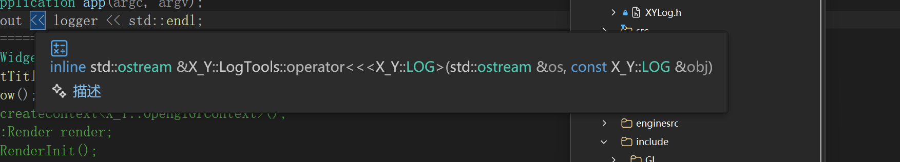
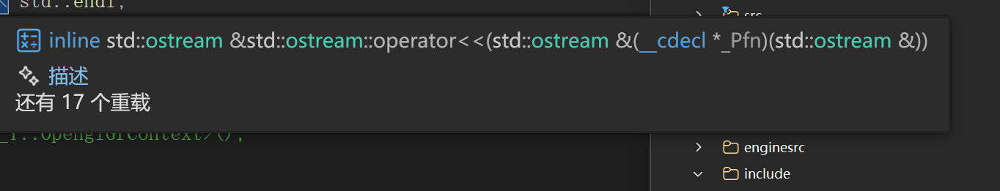

# Log模块总结

---

## 文件介绍

- <span style="color:#2196f3;">XYLog.h </span> 对外暴露的文件，里面有之前写的测试来着，还提供了一个Log类，如果有特殊需求的话可以仿照这个继续写自己的类
- <span style="color:#2196f3;"> LogTools.h</span> 提供一些简单的方法
- <span style="color:#2196f3;"> LogConfigure.h</span> 因为代码也不长，所有的模块都放这里了
- <span style="color:#2196f3;"> LogDeviceExt.h</span> 拓展的输出目标，默认就是打印到控制台，也实现了输出到文件，如果你有一些特殊的需求可以写自己的输出目标，目前基本没用这个文件

---

## 核心想法

- 其实就是想替换这个模板里的内容 **<u>"%r:g:b%[位置][日期][时间][发起者][等级]:[内容]%#"</u>**
- 类会提供一个log方法，接受的第一个参数将替换 **[内容]** , 内部实现对应其他位置的替换
- log之后接受的所有参数都将替换 **[内容]** 里的 **{}** 
- 例如:
```cpp
    int a = 1;
    log("a={}", a);
```
-  **[内容]** 将替换为a=1

---

## 替换的实现

```cpp
//如果你不喜欢用{}匹配参数，可以重写这个函数，可以用regex库
    virtual str PiPei(str s, vec<str> args) {
	    for (auto arg : args) 	replaceModel(s, '{', '}', arg);
	    replaceModel(s, "{{", "{");
	    replaceModel(s, "}}", '}');
	    return s;}
```
- 这是log类里的方法它调用了 <span style="color: blue;">LogTools.h</span> 里的 <span style="color: red;">replaceModel</span>
  
```cpp
# 第一个是整体替换
     template<typename T, typename... Args>
        inline static void replaceModel(std::string& content, T&& model, Args&& ... args) {
            std::string mod = To_Str(std::forward<T>(model));
            //逗号运算符你敢信，它能依次执行，结果是最后表达式结果
            (
                //lambda表达式
                [&](auto&& arg)//参数
                {
                    size_t l = content.find(mod);
                    if (l != std::string::npos) {
                        content.replace(l, mod.size(), To_Str(arg));
                    }
                }//函数体
                (std::forward<Args>(args)),//调用 
                ...);//这里报错可能是编译器犯傻，但能编译运行
        };
#这个允许替换特定符号包裹起来的内容
        template<typename T, typename... Args>
        inline static void replaceModel(std::string& content, T&& le, T&& re, Args&&... args)
        {
            std::string left = To_Str(std::forward<T>(le));
            std::string right = To_Str(std::forward<T>(re));
            std::string cleft = left + left;   // {{
            std::string cright = right + right; // }}

            size_t pos = 0;

            // 正确遍历参数，一个一个替换
            ([&](auto&& arg) {
                while (pos < content.size())
                {
                    // 先找 {{
                    size_t check_double = content.find(cleft, pos);
                    size_t l = content.find(left, pos);

                    // 如果是 {{ ，跳过！
                    if (check_double != std::string::npos && check_double == l)
                    {
                        pos = l + 2;
                        continue;
                    }

                    // 找匹配的 }
                    size_t r = content.find(right, l);
                    if (l == std::string::npos || r == std::string::npos) break;

                    // 正常替换
                    content.replace(l, r - l + 1, To_Str(arg));
                    pos = r + 1;
                    break;
                }
                }(std::forward<Args>(args)), ...);
        }
#其实感觉用正则表达式会更好，但是当时不知道c++有
```
-  除了颜色使用正则表达式替换的之外，剩下的基本都是用上面这两个方法

```cpp
#这个是替换[内容]里面的，调用了PiPei
			template<typename T, typename... Args>
			str replace(T&& content, Args&&... args) {
				std::string s = To_Str(std::forward<T>(content));
				vec<str> args_vec;
				//逗号运算符你敢信，它能依次执行，结果是最后表达式结果
				(args_vec.push_back(To_Str(std::forward<Args>(args))), ...);
				s = PiPei(s, args_vec);
				return s;
			}
#这个更直接了,简单粗暴😄
			//如果你不喜欢这个格式化方式，可以重写这个函数，匹配你想要的模板（model）,可以用regex库
			virtual	str format(str mod, str lev, str content, str file, str line, str func) {
				replaceModel(mod, "[位置]", "[" + file + ":" + line + ":" + func + "]");
				replaceModel(mod, "[日期]", "[" + To_Str(DATE()) + "]");
				replaceModel(mod, "[时间]", "[" + To_Str(TIME()) + "]");
				replaceModel(mod, "[发起者]", "[" + name + "]");
				replaceModel(mod, "[等级]", "[" + lev + "]");
				replaceModel(mod, "[内容]", content);
				replaceColor(mod);
				return mod;
			}

```

```cpp
        // 下面实现颜色替换
        inline static void processColorEscape(std::string &res)
        {
            res = std::regex_replace(res, std::regex(R"(%%)"), "%");
            res = std::regex_replace(res, std::regex(R"(##)"), "#");
        }
        inline static void setColorChar(std::string &res)
        {
            std::regex reg(R"((^|[^%])%(\d+):(\d+):(\d+)%)");
            std::smatch match;
            res = std::regex_replace(
                res,
                reg,
                "$1\x1B[38;2;$2;$3;$4m");
        }
        inline static void setColorBgd(std::string &res)
        {
            std::regex reg(R"((^|[^#])#(\d+):(\d+):(\d+)#)");
            std::smatch match;
            res = std::regex_replace(
                res,
                reg,
                "$1\x1B[48;2;$2;$3;$4m");
        }
        inline static void setColorEnd(std::string &res)
        {
            std::regex reg(R"((^|[^%])%#)");
            std::smatch match;
            res = std::regex_replace(
                res,
                reg,
                "$1\x1B[0m");
        }
        inline static void replaceColor(std::string &result)
        {
            setColorChar(result);
            setColorBgd(result);
            setColorEnd(result);
            processColorEscape(result);
        }
    }
# 使用了正则表达式感觉方便多了
```
---

## 关于输出 (To_Str)

- 在XCore模块里有这个函数 <span style="color:#f44336;">To_Str</span>  <span style="color:#f44336;">~~（将一切转为字符串吧）~~</span>

```cpp
    template <typename E>
    constexpr std::string_view GetEnumName(E value) {
        // 只支持 enum class / enum
        static_assert(std::is_enum_v<E>, "必须是枚举类型");

        // 编译器内置宏，自动提取枚举名（全平台通用：MSVC/GCC/Clang）
#ifdef _MSC_VER
        std::string_view sig = __FUNCSIG__;
        auto start = sig.find_last_of(' ') + 1;
        auto end = sig.find_last_of(']');
#else
        std::string_view sig = __PRETTY_FUNCTION__;
        auto start = sig.find_first_of('=') + 2;
        auto end = sig.find_last_of(';');
#endif

        sig = sig.substr(start, end - start);
        return sig;
    }


    // 1. 检测有没有 toString()
    template<typename T, typename = void>
    struct Has_toString : std::false_type {};

    template<typename T>
    struct Has_toString<T, std::void_t<decltype(std::declval<T>().toString())>>
        : std::true_type {
    };

    // 2. 检测有没有 ToString()
    template<typename T, typename = void>
    struct Has_ToString : std::false_type {};

    template<typename T>
    struct Has_ToString<T, std::void_t<decltype(std::declval<T>().ToString())>>
        : std::true_type {
    };

    template<typename T>
    struct HasToString
    {
        // 两个结果
        static constexpr bool has_low = Has_toString<T>::value;
        static constexpr bool has_upp = Has_ToString<T>::value;

        // 或逻辑
        static constexpr bool value = has_low || has_upp;
    };
   
    template<typename T, typename = void>
    struct HasStatic_toString : std::false_type {};
    
    template<typename T>
    struct HasStatic_toString<T, std::void_t<decltype(T::toString())>>
        : std::true_type {
    };
    template<typename T, typename = void>
    struct HasStatic_ToString : std::false_type {};

    template<typename T>
    struct HasStatic_ToString<T, std::void_t<decltype(T::ToString())>>
        : std::true_type {
    };
    template<typename T>
    struct HasStaticToString
    {
        // 两个结果
        static constexpr bool has_low = HasStatic_toString <T>::value;
        static constexpr bool has_upp = HasStatic_ToString<T>::value;

        // 或逻辑
        static constexpr bool value = has_low || has_upp;
    };
    template <typename T, typename = void>
    struct IsStreamable : std::false_type {};
    template <typename T>
    struct IsStreamable<T, std::void_t<decltype(std::declval<std::ostringstream&>() << std::declval<T>())>>
        : std::true_type {
    };
    template <class T>
    inline  std::string To_Str(const T& obj) {

        if constexpr (std::is_pointer_v<T>) {
            if (obj == nullptr) return "nullptr";
            if constexpr (std::is_same_v<std::remove_cv_t<std::remove_pointer_t<T>>, char>) {
                return std::string(obj);
            }
            return To_Str(*obj); // 解引用，递归调用！
        }


        if constexpr (HasToString<T>::value) {
            return obj.toString();
        }
        else if constexpr (HasStaticToString<T>::value) {
            return T::toString();
        }
        else if constexpr (IsStreamable<T>::value) {
            std::ostringstream oss;
            oss << obj; // 只要类型支持 operator<<，就能直接输出
            return oss.str();
        }
        else if constexpr (std::is_enum_v<T>) {
            std::ostringstream oss;
            oss << GetEnumName(obj);
            return oss.str();
        }
        else {
            return "NO_TO_STRING";
        }
    }

```
- 总结一下就是：
  1. 只要检测到了toString/ToString，不管是指针,静态类方法还是普通对象都能转字符串
  2. 能被输入输出流输出也可以
  3. 后面又加了输出枚举类型名，不能输出其中具体的类型

- 日志里面凡是要转成字符串的基本都用到这个，所以只要你写的对象提供了toString/ToString就能被日志是识别输出
<details>
<summary>🟠 Unexpected-001 | 流运算符重载全局污染问题（点击展开查看错误详情）</summary>

- **log类实现了<<的友元，这样子外界直接 << log对象，可以打印log的信息**
```cpp
		friend std::ostream& operator<<(std::ostream& os, const LogConfigure<T>& log) {
				os << To_Str(log); #log对象也有toString方法所以可以用To_Str
				return os;
			}

``` 
- **另外关于<<**
- <span style="color:#2196f3;">LogTools</span> 里有一个基类CustomLogBase，凡是继承了这个基类的，类内部使用<< 就可以直接使用To_Str，好像没咋用到
```cpp
 // 继承该类的函数，使用<<会自动使用To_Str调用ToString函数（如果有的话），否则输出NO_TO_STRING
// 但是只能类内部使用，外部的<<是普通的输出
        struct CustomLogBase
        {
        };

        template <typename T>
        struct IsCustomLogBase : std::is_base_of<CustomLogBase, T>
        {
        };

        template <class T>
            requires IsCustomLogBase<T>::value // 【外部约束！最直观！】
        inline std::ostream &operator<<(std::ostream &os, const T &obj)
        {
            if constexpr (HasToString<T>::value || HasStaticToString<T>::value)
            {
                return os << To_Str<T>(obj);
            }
            else
            {
                return os << "NO_TO_STRING";
            }
        }
```
- 这样子之后
```cpp
friend std::ostream& operator<<(std::ostream& os, const LogConfigure<T>& log) {
				os << log; #这里的<< 就是上面那个的重载了
				return os;
			}

```

</details>

<details>
<summary>🟢 FIX-001 |  Unexpected-001处理（点击展开查看详情）</summary>

- 让ai检查代码的时候它说下面的友元函数会无限递归 
```cpp

friend std::ostream& operator<<(std::ostream& os，const LogConfigure<T>& log) {
				os << log; #这里的<< 就是上面那个的重载了 🤐它说这里会发生递归
				return os;
			}
```

但事实更离谱,这个友元函数根本没用,我直接删了
还记得那个带有类型检查得 << 吗? 我在里面加了一个输出
```cpp
     template <class T>
            requires IsCustomLogBase<T>::value // 【外部约束！最直观！】
        inline std::ostream &operator<<(std::ostream &os, const T &obj)
        {
            if constexpr (HasToString<T>::value || HasStaticToString<T>::value)
            {
                std::cout << "log内部<<"<< std::endl; ↙️ 
                return os << To_Str<T>(obj);
            }
            else
            {
                return os << "NO_TO_STRING";
            }
        }
```
然后我把那个友元函数注释掉,这一行还是会被输出


## 错误根因
1. 命名空间仅用于防止命名冲突，无法阻断ADL重载查找规则；
2. 头文件中暴露模板运算符重载，所有包含当前头文件的翻译单元都会引入该重载候选；
3. requires仅做类型过滤，不能限制作用域访问权限。

上面是豆包给的解释，但是无所谓了我直接把友元函数给删了，它就算不上意想不到的事情了😄
</details>

## 框架

- 其实感觉要是不涉及到拓展的问题的话，感觉也不用考虑啥框架
- 现在**<u>"%r:g:b%[位置][日期][时间][发起者][等级]:[内容]%#"</u>**已经可以工作了
- 但是如果想要区分不同的日志等级(比如颜色，或者输出信息)靠一个模板肯定是不行的
- 实现日志等级的话可以靠枚举，然后类内维护一个数组存储模板，但是我感觉这样子真的想要拓展起来会很麻烦😵‍💫
- 另外我还希望能够控制输出目标，比如是某个文件，或者其他可能的地方
- 所以接下来要考虑怎么让这两部分可拓展
  
    ### 输出目标

- 先说设备吧（输出目标）
```cpp
#把一切输出目标都抽象成DEVICE，通过重写Log来实现对应位置输出
	struct DEVICE :public CustomLogBase {
			std::ostream* os = &std::cout;
			DEVICE() = default;
			DEVICE(std::ostream& os) :os(&os) {}
			//或许拓展要写
			virtual ~DEVICE() = default;
			virtual std::string toString() const {
				return	"DEVICE";
			};
			virtual void Log(const std::string& message)const {
				*os << message << std::endl;
			}
		};

		struct File :public DEVICE {
			// 成员变量
			std::string _filename;
			std::ofstream file;
			File(
				const std::string& filename,
				std::ios_base::openmode mode = std::ios::out
			)
				:
				DEVICE(),
				_filename(filename),
				file(filename, mode)
			{
				if (!file.is_open()) {
					throw std::runtime_error("打开文件失败: " + filename);
				}
				os = &file;
			}
			std::string toString() const  override { return file.is_open() ? _filename : "文件打开失败"; }
		};
#管理一切Devieces,通过logall直接向所有设备打印
		struct LogDevices :public CustomLogBase {
			std::vector<std::unique_ptr<DEVICE>> devices;

			// 1. 接收裸指针（别人new的）
			void add(DEVICE* dev) {
				if (dev) devices.emplace_back(dev);
			}

			// 2. 接收 unique_ptr（安全转移所有权）
			void add(std::unique_ptr<DEVICE> dev) {
				if (dev) devices.push_back(std::move(dev));
			}
			void clear() {
				devices.clear();
			}
			void remove(DEVICE* dev) {
				devices.erase(std::remove_if(devices.begin(), devices.end(),
					[dev](const std::unique_ptr<DEVICE>& d) { return d.get() == dev; }),
					devices.end());
			}
			void logAll(const std::string& msg) {
				for (auto& dev : devices) dev->Log(msg);
			}
			std::string toString() const {
				std::string result;
				for (const auto& dev : devices) {
					result += dev->toString() + " ";
				}
				return result.empty() ? "No Devices" : result;
			}

			// 禁止外部拷贝管理器，防止乱生命周期
			LogDevices() = default;
			~LogDevices() = default;
			LogDevices(const LogDevices&) = delete;
			LogDevices& operator=(const LogDevices&) = delete;
		};
```
- 接下来只要让Log类拥有LogDevices就万事大吉了，A座~（没错）我直接让log类继承了这个LogDevices,这样我就可以直接使用它的所有方法😄
```cpp
template<typename T>
		class LogConfigure :public LogDevices {
		public:

			using str = std::string;
			template<typename T> using vec = std::vector<T>;
			using Self = T;
			using LogDevices::logAll;
			using LogDevices::add;
			using LogDevices::remove;
			using LogDevices::clear;
			using LogDevices::toString;
			template<typename A, typename B>
			using LEVEL = ::X_Y::LogConfigure::LEVEL<A, B>;
        }
```
   ### LEVEL
- LEVEL的实现也差不多吧，写个Level类然后让它拥有自己的模板
- 但是这就又要考量一个问题了我的log输出的时候怎么判断自己是用那个模板呢
- 我比较喜欢的方式是直接就能从使用的类名推断出来，这样子所有的类都将成为静态类，不需要实例化
- 接下来的问题是，如果是静态类的话全局唯一，如果我有两个log对象他们想要使用同名但是模板不同的类就会出现问题。
- 所以我让LogConfigure属于模板类，就好比你想要某种日志类型的时候你就可以用它临时装配出了一个，每个类内部实现LEVEL，这样子的话同一个日志类型的LEVEL一样，但是你可以毫不费力的装配出其他类型的日志类型，例如：LogConfigure< void >,LogConfigure< int >...就可以实现同名但是不同模板的LEVEL

```cpp
#LogConfigure<type> 里实现日志输出的函数，使用类似于Log<Info>(...)
	template<typename LevelType, typename T, typename... Args>
	void Log(const char* file, int line, const char* func, T&& content, Args&&... args) {
			str lev = LevelType::toString();
			str model = LevelType::model();
			str result = replace(content, args...);
			str Mfile = file == nullptr ? UN_KNOW : To_Str(file);
			str MLine = line == -1 ? UN_KNOW : To_Str(line);
			str Mfunc = func == nullptr ? UN_KNOW : To_Str(func);
			result = format(model, lev, result, Mfile, MLine, Mfunc);
			logAll(result);
			}
```


```cpp
#LEVEL模块
	template<typename LEVEL_TYPE, typename SELF_TYPE>
		struct LEVEL :public CustomLogBase {
			LEVEL() = delete;
			static std::string& model()
			{
				static std::string m;
				return m;
			}
			static void setModel(std::string m) { model() = m; }
			static std::string getModel() { return model(); }
			static std::string toString() { return "LEVEL"; }
		};
		//template<typename LEVEL_TYPE, typename SELF_TYPE> std::string LEVEL<LEVEL_TYPE, SELF_TYPE>::model;
#define LOG_LEVEL_ALL \
public: \
    struct Trace : LEVEL<Trace, Self> { \
       static std::string toString() { return "TRACE"; } \
    }; \
    struct Debug : LEVEL<Debug, Self> { \
        static std::string toString() { return "DEBUG"; } \
    }; \
    struct Info : LEVEL<Info, Self> { \
        static std::string toString() { return "INFO"; } \
    }; \
    struct Warn : LEVEL<Warn, Self> { \
        static std::string toString() { return "WARN"; } \
    }; \
    struct Error : LEVEL<Error, Self> { \
        static std::string toString() { return "ERROR"; } \
    }; \
    struct Fatal : LEVEL<Fatal, Self> { \
        static std::string toString() { return "FATAL"; } \
    };

#define LOG_LEVEL_EXT(LevelName) \
	struct LevelName : LEVEL<LevelName, Self> { \
		static std::string toString() { return #LevelName; } \
	};
#实现用宏拓展

```

```cpp
#完整LogConfigure
	template<typename T>
		class LogConfigure :public LogDevices {
		public:

			using str = std::string;
			template<typename T> using vec = std::vector<T>;
			using Self = T;
			using LogDevices::logAll;
			using LogDevices::add;
			using LogDevices::remove;
			using LogDevices::clear;
			using LogDevices::toString;
			template<typename A, typename B>
			using LEVEL = ::X_Y::LogConfigure::LEVEL<A, B>;
			
			
			
			LOG_LEVEL_ALL
			LOG_ALL_API #其实这个宏不是很重要


				LogConfigure() {
				name = "DefaultLogger";
				this->add(new DEVICE());
				Trace::setModel("%180:180:180%[位置][日期][时间][发起者][等级]:[内容]%#");
				Debug::setModel("%90:180:255%[位置][日期][时间][发起者][等级]:[内容]%#");
				Info::setModel("%80:220:100%[位置][日期][时间][发起者][等级]:[内容]%#");
				Warn::setModel("%255:210:0%[位置][日期][时间][发起者][等级]:[内容]%#");
				Error::setModel("%255:80:80%[位置][日期][时间][发起者][等级]:[内容]%#");
				Fatal::setModel("%220:0:0%[位置][日期][时间][发起者][等级]:[内容]%#");

			}
			LogConfigure(str name)
				: name(name)
			{
				this->add(new DEVICE());
				Trace::setModel("%180:180:180%[位置][日期][时间][发起者][等级]:[内容]%#");
				Debug::setModel("%90:180:255%[位置][日期][时间][发起者][等级]:[内容]%#");
				Info::setModel("%80:220:100%[位置][日期][时间][发起者][等级]:[内容]%#");
				Warn::setModel("%255:210:0%[位置][日期][时间][发起者][等级]:[内容]%#");
				Error::setModel("%255:80:80%[位置][日期][时间][发起者][等级]:[内容]%#");
				Fatal::setModel("%220:0:0%[位置][日期][时间][发起者][等级]:[内容]%#");
			}
			virtual ~LogConfigure() {};
			void setname(str name) { this->name = name; }
			std::string toString() const {
				std::ostringstream oss;
				oss << "日志发起者: " << name << "\n";
				oss << "链接输出设备:" << LogDevices::toString();
				return oss.str();
			}
			template<typename LevelType, typename T, typename... Args>
			void log(T&& content, Args&&... args) {
				// 内部直接调用私有版本，传默认值
				Log<LevelType>(nullptr, -1, nullptr,
					std::forward<T>(content),
					std::forward<Args>(args)...);
			}
			template<typename LevelType, typename T, typename... Args>
			void Log(const char* file, int line, const char* func, T&& content, Args&&... args) {
				str lev = LevelType::toString();
				str model = LevelType::model();
				str result = replace(content, args...);
				str Mfile = file == nullptr ? UN_KNOW : To_Str(file);
				str MLine = line == -1 ? UN_KNOW : To_Str(line);
				str Mfunc = func == nullptr ? UN_KNOW : To_Str(func);

				result = format(model, lev, result, Mfile, MLine, Mfunc);
				logAll(result);
			}
		private:
			template<typename T, typename... Args>
			str replace(T&& content, Args&&... args) {
				std::string s = To_Str(std::forward<T>(content));
				vec<str> args_vec;
				//逗号运算符你敢信，它能依次执行，结果是最后表达式结果
				(args_vec.push_back(To_Str(std::forward<Args>(args))), ...);
				s = PiPei(s, args_vec);
				return s;
			}
			//如果你不喜欢这个格式化方式，可以重写这个函数，匹配你想要的模板（model）,可以用regex库
			virtual	str format(str mod, str lev, str content, str file, str line, str func) {
				replaceModel(mod, "[位置]", "[" + file + ":" + line + ":" + func + "]");
				replaceModel(mod, "[日期]", "[" + To_Str(DATE()) + "]");
				replaceModel(mod, "[时间]", "[" + To_Str(TIME()) + "]");
				replaceModel(mod, "[发起者]", "[" + name + "]");
				replaceModel(mod, "[等级]", "[" + lev + "]");
				replaceModel(mod, "[内容]", content);
				replaceColor(mod);
				return mod;
			}


			//如果你不喜欢用{}匹配参数，可以重写这个函数，可以用regex库
			virtual  str PiPei(str s, vec<str> args) {
				for (auto arg : args) {
					replaceModel(s, '{', '}', arg);
				}
				replaceModel(s, "{{", "{");
				replaceModel(s, "}}", '}');
				return s;
			}

			// friend std::ostream& operator<<(std::ostream& os, const LogConfigure<T>& log) {
			// 	os << To_Str(log);
			// 	//os << log;
			// 	return os;
			// }

		public:
			str name;
		};
```
- 以上近乎全部内容了
- <span style="color:#2196f3;">XYLog.h</span>里有实现一个现成的Log日志类型
